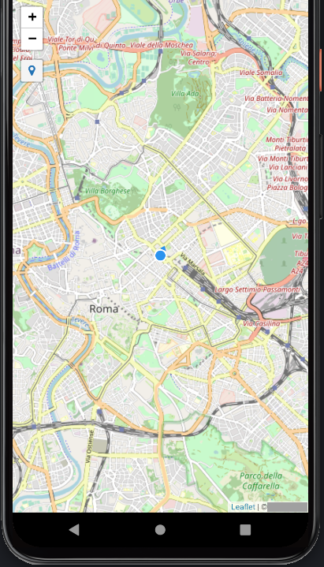

# Capacitor-Leaflet.locatecontrol

Version of [Leaflet.locatecontrol](https://github.com/domoritz/leaflet-locatecontrol) that implements [@capacitor/geolocation](https://capacitorjs.com/docs/apis/geolocation)

## Screenshot

